# TP4CCNA

## I-Mise en place du lab  

### 1.Création des réseaux
### 2.Création des VMs
### 3.Mise en place du routage statique
* Client1 ping Server1  
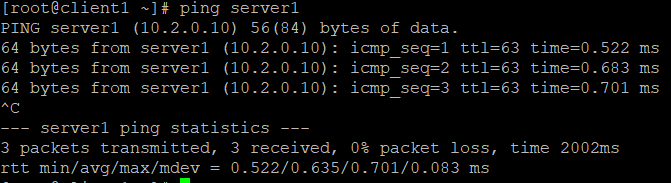   
* Server1 ping Client1  
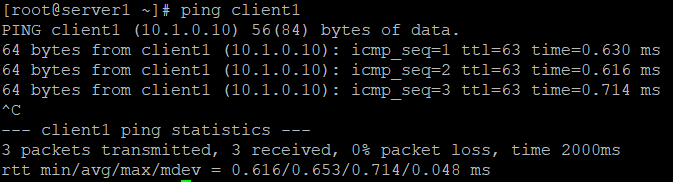  
* Traceroute depuis le client1 pour voir le chemin pris par server1  
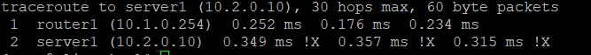  
## II-Spéciologie réseau  

### 1.ARP
#### A.Manip 1
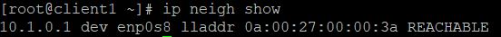    
On obtient seulement cette ligne puisque aucune autre VM n'a ping sur le client.  

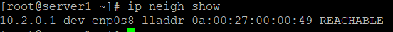   
On obtient la aussi une seule ligne etant donné qu'aucune autre VM n'a ping sur le server1.   

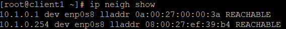   
Nous avons maintenant l'addresse de celui que nous avons ping

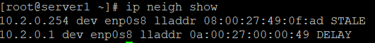  
Et inversement pour le server1.

#### B.Manip2  
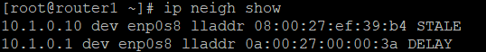  
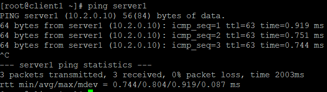
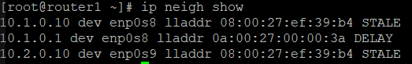

#### C.Manip3
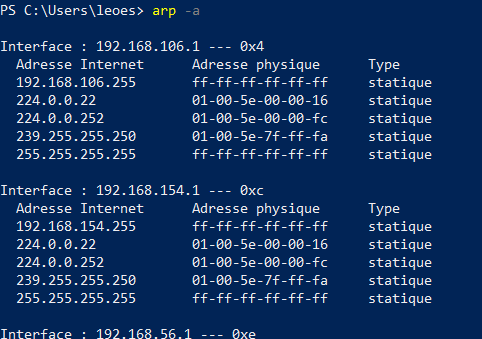
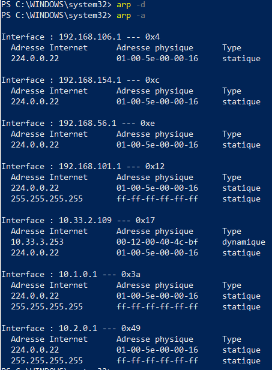

#### D.Manip4
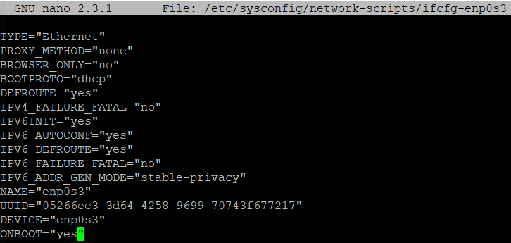
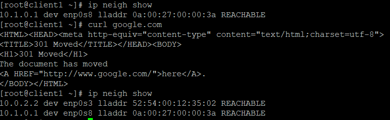

### 2.Wireshark

#### A.Interception d'ARP et ping  
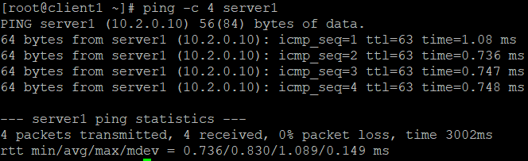   
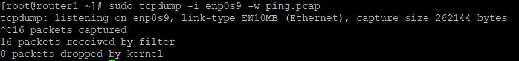 
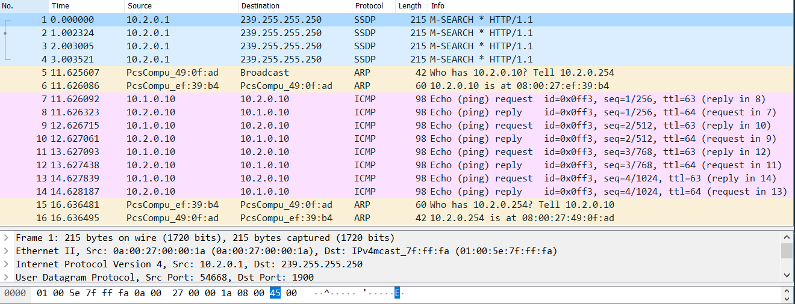  
